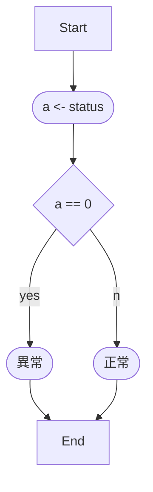
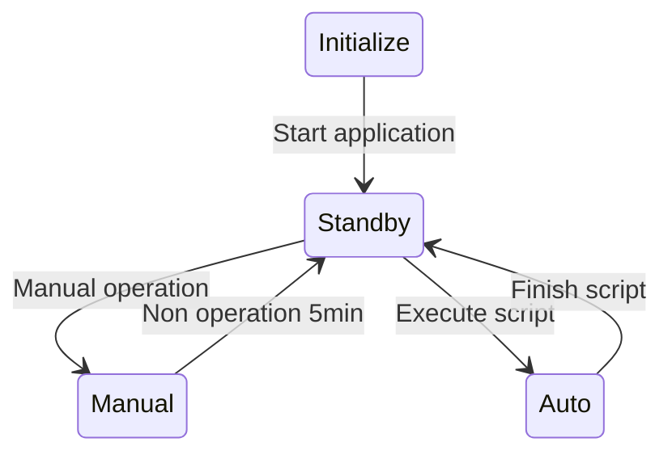
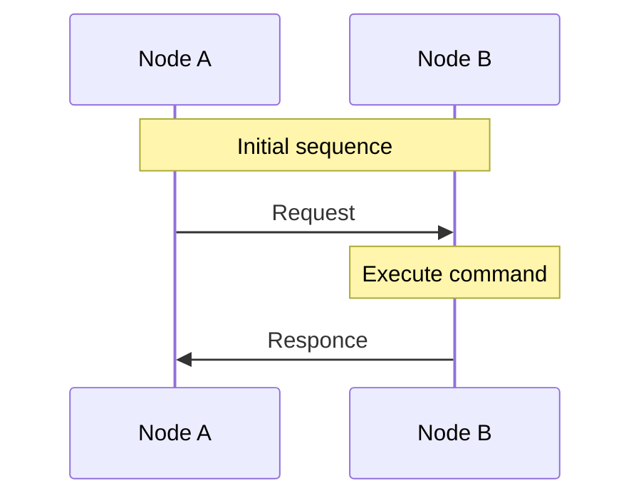

<link href="./fig_table_num.css" rel="stylesheet"></link>

# 1. 目次

- [1. 目次](#1-目次)
- [2. 概要](#2-概要)
- [3. 構成](#3-構成)
- [4. 機能](#4-機能)
  - [4.1. AAA](#41-aaa)
  - [4.2. BBB](#42-bbb)
  - [4.3. CCC](#43-ccc)

# 2. 概要

- 箇条書き
  - 入れ子
  - 入れ子
- 箇条書き
- 箇条書き

# 3. 構成
機器構成を<a href="#ref_struct">xxx</a>に示す。

基本図形

# 4. 機能

テーブル見本

|  No.  | 機能名 | 説明   | 備考 |
| :---: | :----- | :----- | :--- |
|   1   | AAA    | ～を ～する |      |
|   2   | BBB    | ～する |      |

## 4.1. AAA

フローチャート

## 4.2. BBB

状態遷移図

## 4.3. CCC

シーケンス図
